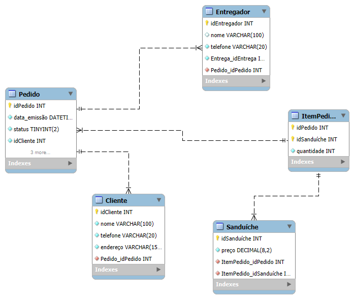

# Banco de Dados – Lanchonete

Projeto acadêmico desenvolvido para a disciplina de Banco de Dados.

## Descrição
Este projeto consiste na modelagem e implementação de um banco de dados para uma
lanchonete, com o objetivo de gerenciar clientes, pedidos, entregadores, sanduíches
e os itens de cada pedido.

O modelo foi desenvolvido seguindo boas práticas de modelagem relacional,
utilizando relacionamentos 1:N e N:N.

## Modelo Lógico

## Tecnologias Utilizadas
- MySQL
- MySQL Workbench

## Estrutura do Banco de Dados
- **Cliente**: armazena os dados dos clientes
- **Pedido**: registra os pedidos realizados
- **Entregador**: controla os entregadores disponíveis
- **Sanduíche**: representa o cardápio da lanchonete
- **ItemPedido**: tabela associativa que relaciona pedidos e sanduíches

## Observação
Projeto desenvolvido exclusivamente para fins acadêmicos.
